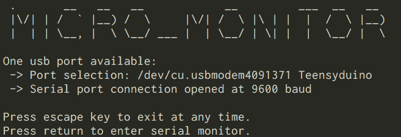
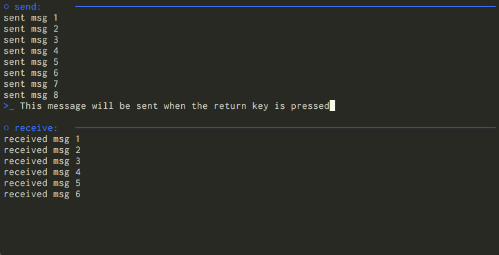
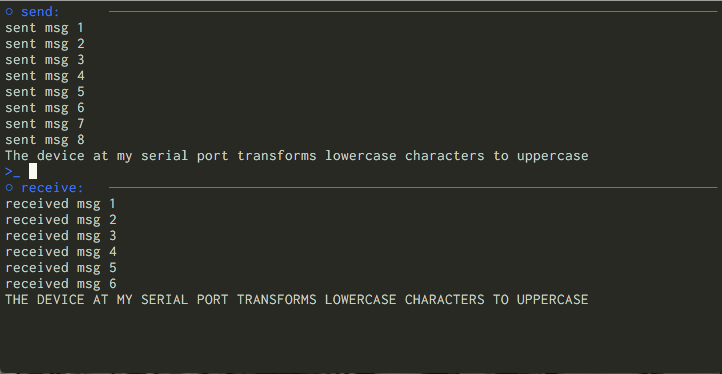
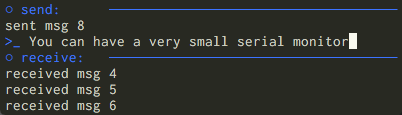

# micro_monitor.py

*A lightweight command line serial monitor for communicating with microcontrollers*

This project was inspired by the Arduino IDE's serial monitor which is useful while developing and debugging code on an external device like an Arduino or Teensy board.

The project is built with Python 3, it uses the [pySerial library](https://github.com/pyserial/) to identify and communicate with serial ports, and it uses the python [Curses library](https://docs.python.org/3/library/curses.html#module-curses) to render a simple text based user interface in a terminal window.

This script has been tested using Mac OS and Linux but it may work for Windows as well.

## Installation

Python 3 and the pip package manager are required, if you don't have them, learn how to install them [here](https://docs.python-guide.org/starting/installation/).

Before using micro_monitor, use pip install the dependences:

```bash
pip install -r requirements.txt
```

If you like the tool, you may want to make it executable and save an alias for it in your system.

## Using micro_monitor.py

### Opening a connection

Navigate to the repository in your terminal and run the script. Note that on a Linux machine serial ports may be reserved for administrators, you may need to run the script with `sudo`.

```bash
cd micro_monitor/
python3 micro_monitor.py
```

micro_monitor first checks for available serial ports. Because printers and other devices often appear in this list, it only searches for devices which include "usb" in their name. If one port exists, it is selected by default, if multiple ports exist you may select the desired one.

Connections are opened at a baudrate of 9600 by default.

```bash
One usb port available:
 -> Port selection: /dev/cu.usbmodem4091371 Teensyduino
 -> Serial port connection opened at 9600 baud
```

### The Monitor Window

Once a connection is available, press `return` to enter the serial monitor window. You may press the `escape` key to exit at any time.

The window is divided in half into send and receive sections.

A prompt in the send section allows you to compose a string to send to the serial port. This prompt is very basic, only ascii characters are allowed but it is possible to type a simple command, use the `backspace` key and press `return` to send the command. 



The receive section displays the most recently received messages from the serial port.



The monitor window may be resized while the script runs. The most recently sent and recieved messages are always displayed.



Note that the Curses temporarily changes the way the terminal reacts. If micro_monitor doesn't exit gracefully you may find a mess of characters left on the screen and that text is not wrapping properly. To fix this, just type the terminal command `reset`. 

You may also find that if you attempt to scroll in your terminal window, you no longer see the most recently rendered text output. In that case, press any key to get back into the terminal user interface.

## Trying it out

Because micro_monitor.py requires something to communicate with, a good example program for a microcontroller will send data to its serial port and then accept, process and return messages. As an example I've been using a program that translates incoming strings to uppercase. If you have an Arduino compatible microcontroller, you can use the following code, which is also included in the repository under `example_arduino_sketch/`:

```cpp
int inByte = 0;         // incoming serial byte

int i = 0;

void setup() {
  // start serial port at 9600 bps and wait for port to open:
  Serial.begin(9600);
  while (!Serial) {
    ; // wait for serial port to connect. Needed for native USB port only
  }
  establishContact();  // send a byte to establish contact until receiver responds
}

void loop() {
  if (Serial.available() > 0) {
    // get incoming byte:
    inByte = Serial.read();
    if (inByte == 10) {
      Serial.println();
    }
    else {
      // Check if inByte is in the lowercase range
      if (inByte >= 97 && inByte <= 122) {
        inByte = inByte - 32;
      }
      Serial.write(inByte);
      i++;
    }
  }
}

void establishContact() {
  while (Serial.available() <= 0) {
    Serial.println("Waiting for a byte..");   // send an initial string
    delay(300);
  }
}
```


## Acknowledgments and Resources

* **pySerial**  - *Great documentation* - [pySerial Docs](https://pythonhosted.org/pyserial/)
* **Python Curses Tutorial** - *A big picture introduction to Curses* - [Tutorial Videos](https://www.youtube.com/channel/UCXCA0fPu6uPjWv9p4uUrpEQ)
* **Basics of communicating with serial ports in unix**
  * [Receiving data](https://arduino.stackexchange.com/questions/19002/use-unix-terminal-instead-of-the-monitor-on-arduino-ide)
  * [Sending data](https://stackoverflow.com/questions/32018993/how-can-i-send-a-byte-array-to-a-serial-port-using-python)
* **Handling special characters in Curses** - *A very helpful function* - [The Developer's Cry Blog](http://devcry.heiho.net/html/2016/20160228-curses-practices.html)
* **Detecting the backspace key in Curses**
  * [Detecting the backspace key in Mac OS terminals](https://stackoverflow.com/questions/47481955/python-curses-detecting-the-backspace-key?rq=1)
  * [Detecting the backspace key in Ubuntu Xterm terminals](https://stackoverflow.com/questions/44943249/detecting-key-backspace-in-ncurses)